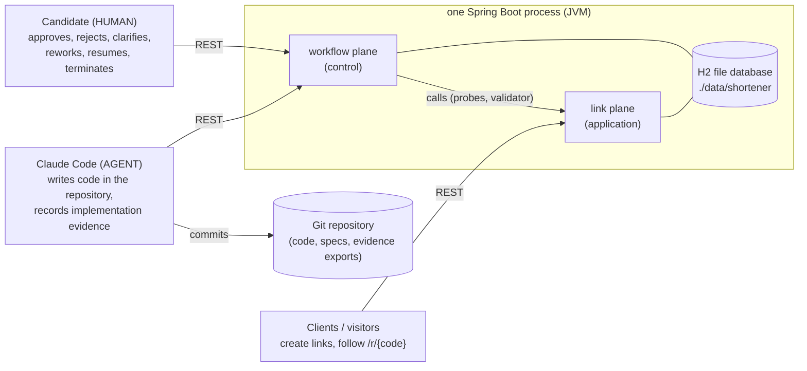
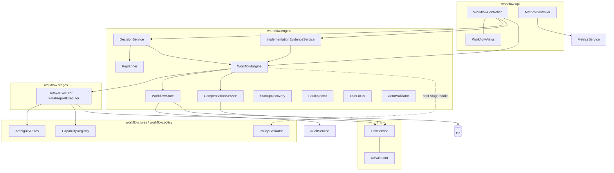
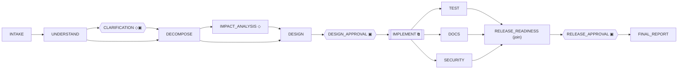
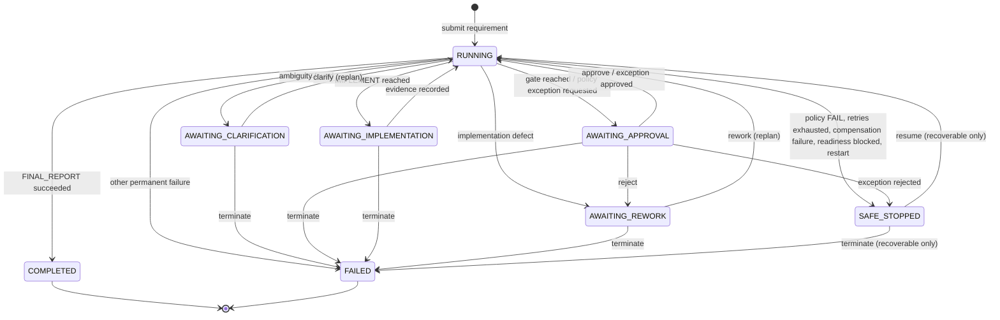
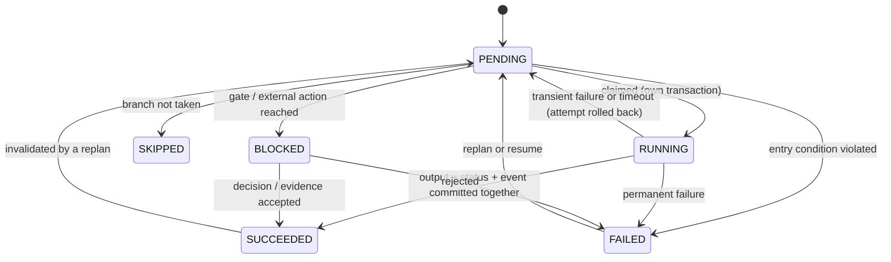
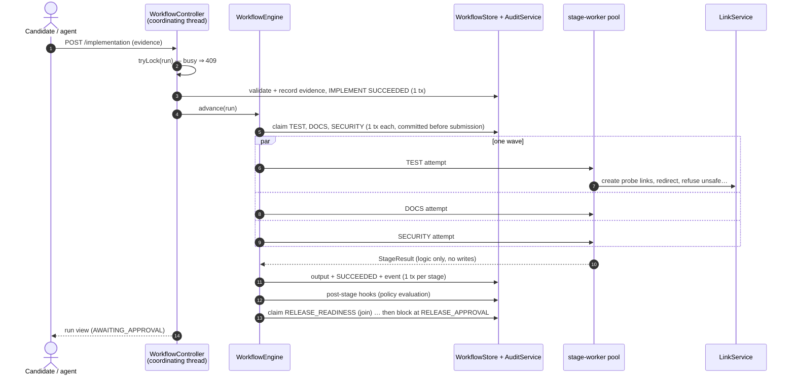
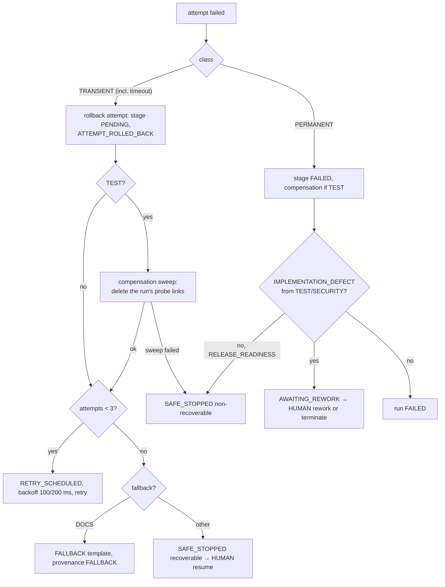
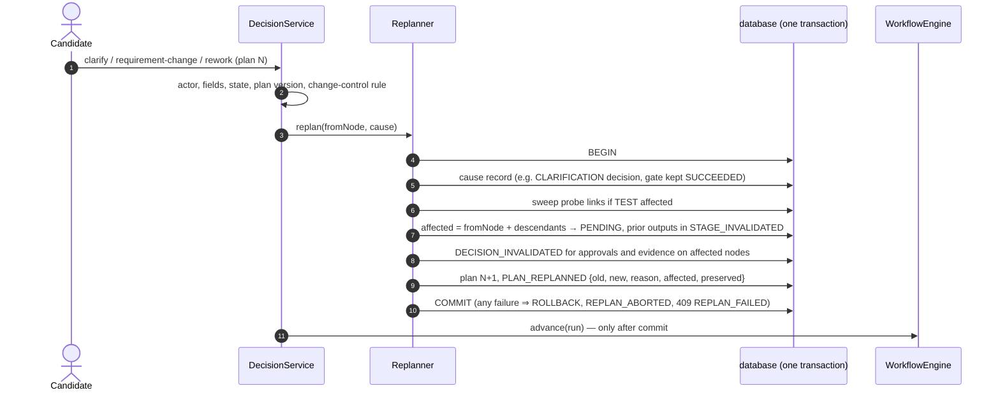

# Architecture overview

An agentic software-engineering workflow that governs changes to a URL shortener. It takes a requirement,
understands and decomposes it, designs the change, waits for human approval, records the implementation
done outside the application, validates the running build in parallel, checks release readiness and waits
for release approval. Decisions behind this design: [ADR-0001…0005](../adr/README.md). Requirements:
[spec](../../specs/001-agentic-sdlc-url-shortener/spec.md); plan: [plan](../../specs/001-agentic-sdlc-url-shortener/plan.md).

Contents: 1 system context · 2 runtime view · 3 components and classes · 4 the dependency graph and node
contracts · 5 state machines · 6 execution model · 7 data model · 8 API and errors · 9 autonomy boundary
· 10 governance · 11 reliability · 12 replanning · 13 observability · 14 configuration · 15 testing
architecture · 16 requirement → component · 17 decisions, trade-offs, scaling.

## 1. System context

- The **workflow plane** may call the link plane (acceptance probes, URL validator). The **link plane never
  depends on the workflow plane**: `PlaneBoundaryTest` fails the build if any `link` class references
  `workflow` (ADR-0001).
- The application never writes code and never reads Git. Code reaches the workflow only as structured
  evidence; its behavior is then verified by probing the running build.

## 2. Runtime view

| Aspect | Choice |
|---|---|
| Process | one JVM, Spring Boot 3.5.16, Java 21, embedded Tomcat on port 8080 |
| Threads | HTTP request threads (Tomcat) act as **coordinating threads**; a fixed pool of **4 `stage-worker-N` threads** executes stage logic |
| Storage | H2 2.3 in file mode (`./data/shortener.mv.db`); schema owned by Flyway (V1 workflow, V2 links, V3 expiration); Hibernate only validates |
| Profiles | default (fault injection off); `demo` (fault injection on); `test` (in-memory database, used by the test suite) |
| Exposure | REST API + `GET /actuator/health` only; no UI |
| Startup | Flyway migrates, then `StartupRecovery` safe-stops runs interrupted by a previous stop |

## 3. Components and classes

| Package | Classes | Responsibility |
|---|---|---|
| `link` | `LinkController`, `RedirectController`, `LinkService`, `UrlValidator`, `ShortCodeGenerator` + `SecureRandomShortCodeGenerator`, `Link`, `IdempotencyRecord`, repositories, `LinkConfiguration` (`Clock`) | the URL shortener: create, redirect (302 `no-store`), analytics, idempotency keys, optional expiration (410), probe-link helpers |
| `workflow.api` | `WorkflowController`, `WorkflowRequests`, `WorkflowViews`, `MetricsController` | REST endpoints; request records; response views |
| `workflow.engine` | `WorkflowEngine` | wave scheduling, retry/timeout/fallback, outcome routing |
| | `WorkflowStore` | the only write path for run and stage state (each change its own transaction, with its audit events) |
| | `DecisionService`, `ImplementationEvidenceService`, `ActorValidator` | validated HUMAN/AGENT commands; refusals recorded |
| | `Replanner` | atomic replanning |
| | `CompensationService`, `StartupRecovery`, `FaultInjector` (+ `Fault`, `FaultPoint`, `FaultType`, `InjectedFault`) | compensation, restart recovery, demonstration faults |
| | `WorkflowGraph`, `NodeDefinition`, `StageExecutor`, `StageContext`, `StageResult`, `CancellationToken`, `RunLocks`, `PostStageHook`, `UnderstandingRecorder`, `WorkflowProperties` | engine contracts and infrastructure |
| `workflow.stages` | `IntakeExecutor`, `UnderstandExecutor`, `DecomposeExecutor`, `ImpactAnalysisExecutor`, `DesignExecutor`, `TestStageExecutor`, `DocsExecutor`, `SecurityExecutor`, `ReleaseReadinessExecutor` (+ pure `ReleaseReadiness`), `FinalReportExecutor` | one deterministic executor per automated node |
| `workflow.rules` | `AmbiguityRules`, `RecordedBehaviorRules`, `CapabilityRegistry` (+ `Capability`, `CapabilityEntry`, `BehaviorStatement`) | ambiguity detection, brownfield and change-control rules, the capability registry |
| `workflow.policy` | `PolicyCatalog`, `PolicyEvaluator` | policy v1 checks, evaluated as a post-stage hook |
| `workflow.persistence`, `workflow.audit` | entities, repositories, `AuditService` | persistence; the append-only audit trail |
| `workflow.metrics` | `MetricsCalculator` (pure), `MetricsService` | demonstration metrics derived from runs and events |
| `common` | `ApiException`, `ErrorCategory`, `GlobalExceptionHandler` | the error model |

## 4. The dependency graph and node contracts

◇ conditional (taken or SKIPPED, recorded as a BRANCH decision) · ▣ human gate · ⧉ external action

| Node | Kind | Does | Exit condition / failure |
|---|---|---|---|
| INTAKE | automated | accepts the requirement (non-blank, ≤ 4,000 chars) | — |
| UNDERSTAND | automated | normalizes; finds capabilities; ambiguity findings AMB-R1…R4; GREENFIELD/BROWNFIELD | PRIV-01 evaluated after it |
| CLARIFICATION | gate, conditional | taken when findings exist; waits for a HUMAN clarification | another round if still ambiguous |
| DECOMPOSE | automated | one task per capability with requirement IDs and acceptance checks | entry: no open ambiguity; unknown vocabulary ⇒ PERMANENT |
| IMPACT_ANALYSIS | automated, conditional | brownfield only: ten areas + data flows from the registry | all ten areas populated (CHG-01) |
| DESIGN | automated | components, interface and data changes, test plan, dependencies, requirement IDs, `implementationRequired`, `changesApprovedRequirements` | every task mapped to a component; SEC-01, CHG-01, DEP-01 after it |
| DESIGN_APPROVAL | gate | HUMAN approval at the current plan version | rejection ⇒ AWAITING_REWORK |
| IMPLEMENT | external action | waits for evidence (changed artifacts + revision, or a no-change justification) | scope, ordering and structure validated |
| TEST | automated, parallel | runs every task's acceptance probes against the running build through `LinkService` (real probe links, removed afterwards) | failing probe ⇒ PERMANENT `IMPLEMENTATION_DEFECT` |
| DOCS | automated, parallel | builds 8 required sections from design, registry and evidence | FALLBACK template after exhausted retries |
| SECURITY | automated, parallel | probes the validator with 20 unsafe inputs + one safe control | any unsafe input accepted ⇒ `IMPLEMENTATION_DEFECT`; never falls back |
| RELEASE_READINESS | automated, join | policies resolved, every task check passed, AUD-01, no leftover probe links, residual risks | blocked ⇒ non-recoverable safe-stop |
| RELEASE_APPROVAL | gate | HUMAN release decision with accepted risks | rejection ⇒ AWAITING_REWORK |
| FINAL_REPORT | automated | idempotent report from persisted records, citing audit `seq` numbers | — |

## 5. State machines

**Run status**

A requirement change is accepted from any waiting state or a recoverable SAFE_STOPPED and returns the run to
RUNNING through a replan. Non-recoverable SAFE_STOPPED, COMPLETED and FAILED are final.

**Stage status**

## 6. Execution model

**Wave algorithm** (`WorkflowEngine.advance`): load the run; if every stage is SUCCEEDED or SKIPPED, complete
it. Otherwise find the PENDING nodes whose dependencies are all done. Record a branch decision for any
undecided conditional node; block on the first eligible gate or external action; otherwise run all eligible
automated nodes as one **wave** and repeat.

| Concern | Rule |
|---|---|
| **H1 thread ownership** | pool threads only execute stage logic and return a `StageResult`; every database and audit write happens on the coordinating thread holding the run lock (`WorkflowStore` asserts it) |
| **H2 transactions** | no command-wide transaction: claim, completion, failure, decision and each event are short transactions; the replan is the only multi-step transaction |
| **H3 cancellation** | each attempt has its own `CancellationToken`; a timed-out attempt's token is revoked, its late result is discarded, and the engine waits for the worker to stop before compensating |
| **H4 locking** | one in-process `ReentrantLock` per run taken with `tryLock()` — a concurrent command gets `409 run busy` immediately; optimistic `@Version` and conditional `PENDING→RUNNING` updates as a second guard |
| Hooks | post-stage hooks run on the coordinating thread: `UnderstandingRecorder` (normalized requirement, reopening a clarification round) and `PolicyEvaluator` |

## 7. Data model

Seven tables, all created by Flyway migrations (`src/main/resources/db/migration`).

| Table | Key columns | Notes |
|---|---|---|
| `workflow_run` | `id` UUID, `status`, `pending_action`, `plan_version`, `policy_version`, `original_requirement`, `current_requirement`, `change_type`, `recoverable`, `stop_reason`, `fault_plan_json`, `version` | one row per run; `fault_plan_json` non-null marks an injected run |
| `workflow_stage` | (`run_id`, `node`) PK, `status`, `attempts`, `started_at`, `ended_at`, `thread_name`, `output_json`, `provenance`, `failure_class/code/reason`, `plan_version` | 14 rows per run; outputs persisted as JSON |
| `decision` | `id`, `run_id`, `type`, `gate`, `actor_type`, `actor_identity`, `reason`, `plan_version`, `supersedes_id`, `payload_json` | decision lineage; invalidation supersedes, nothing is edited |
| `policy_evaluation` | `run_id`, `check_id`, `domain`, `node`, `mandatory`, `result`, `reason`, `plan_version`, `resolution_decision_id` | one row per evaluation |
| `audit_event` | `run_id`, `seq` (unique per run), `type`, `node`, `actor_type/identity`, `plan_version`, `policy_version`, `injected`, `payload_json` | **append-only** (the repository has no update or delete); gap-free `seq` per run |
| `link` | `id`, `code` (unique), `original_url`, `created_at`, `redirect_count`, `last_redirect_at`, `probe_run_id`, `expires_at` (V3) | the only cross-plane reference is `probe_run_id`, a plain tag |
| `idempotency_record` | `idem_key` PK, `request_fingerprint` (SHA-256), `link_id` | |

There is no recovery table: recovery incidents and metrics are derived from `audit_event`.

## 8. API and errors

Contract: [openapi.yaml](../../specs/001-agentic-sdlc-url-shortener/contracts/openapi.yaml), checked in both
directions by `OpenApiContractTest` (19 operations, 7 response schemas).

| Area | Operations |
|---|---|
| Links | `POST /api/links` (optional `Idempotency-Key`, optional `expiresAt`) · `GET /api/links/{code}` · `GET /r/{code}` |
| Runs (read) | `POST /api/workflows` · `GET /api/workflows/{id}` · `…/events` · `…/decisions` · `…/report` |
| Runs (commands) | `…/approve` · `…/reject` · `…/clarify` · `…/requirement-change` · `…/rework` · `…/implementation` · `…/policy-exceptions/{checkId}` · `…/resume` · `…/terminate` |
| Operations | `GET /api/metrics/workflows[?faultInjected=]` · `GET /actuator/health` |

Every error is RFC 9457 Problem Details with a `category`, never a stack trace:

| HTTP | Categories |
|---|---|
| 400 | `VALIDATION`, `FAULT_INJECTION_DISABLED` |
| 404 | `NOT_FOUND` |
| 409 | `CONFLICT` (incl. run busy), `INVALID_STATE`, `STALE_PLAN_VERSION`, `EVIDENCE_SCOPE_MISMATCH`, `CHANGE_CONTROL_REQUIRED`, `REPLAN_FAILED` |
| 410 | `EXPIRED` |
| 503 | `STORAGE_UNAVAILABLE`, `CODE_SPACE_EXHAUSTED` |
| 500 | `INTERNAL` |

## 9. Autonomy boundary (who does what)

| Actor | May | May not |
|---|---|---|
| **SYSTEM** (`workflow-engine`) | run automated stages, take branches, record events, invalidate decisions on replan | be named by an API caller |
| **AGENT** (`claude-code`) | submit requirements; record implementation evidence | approve, reject, clarify, rework, resume, terminate, decide policy exceptions |
| **HUMAN** (the candidate) | every gate decision, clarification, rework, requirement change, resume, terminate, policy exception | — |

The stage "agents" inside the application are **deterministic** executors: reproducible rules and the
capability registry, not a language model (AMB-001; determinism is tested by `DeterminismTest`). The coding
agent is Claude Code, working outside the application; its work enters the workflow only as structured
evidence at IMPLEMENT, and TEST and SECURITY then verify the running build independently. Every command is
checked in a fixed order — actor, required fields, waiting state, plan version — and a refused command is
recorded as `DECISION_REFUSED` with the run unchanged.

## 10. Governance and guardrails

| Check | Domain | Evaluated after | FAIL / exception |
|---|---|---|---|
| PRIV-01 | privacy (personal data capture) | UNDERSTAND | EXCEPTION_REQUESTED ⇒ the run waits for a HUMAN decision |
| SEC-01 | URL safety not weakened | DESIGN | FAIL ⇒ non-recoverable safe-stop before design approval |
| CHG-01 | brownfield impact analysis complete | DESIGN | FAIL ⇒ safe-stop |
| DEP-01 | dependencies and licenses | DESIGN | FAIL ⇒ safe-stop |
| AUD-01 | every executed node and decision audited, gap-free trail | RELEASE_READINESS | blocks readiness |

- **Policy exceptions** record policy id, reason, scope, approving actor, compensating control, timestamp and
  expiry or review condition; a dated expiry that has passed counts as unapproved at readiness.
- **Change control**: a clarification that contradicts an approved requirement is refused (`409
  CHANGE_CONTROL_REQUIRED`) and must go through a requirement change, whose DESIGN lists the changed
  requirements.
- **Evidence rules**: changed artifacts need a revision; "no change" needs a justification and is accepted only
  when DESIGN says no implementation is required; requirement IDs must be in the run's scope; evidence must
  follow a valid (not superseded) design approval.

## 11. Reliability

| Mechanism | Behavior |
|---|---|
| Retry | transient failures only; 3 attempts; backoff 100 ms, 200 ms |
| Timeout | 5 s per automated stage (gates and IMPLEMENT exempt); token revoked; late result discarded |
| Fallback | DOCS only |
| Rollback | a failed attempt commits nothing (output and SUCCEEDED commit together) |
| Compensation | idempotent sweep of the run's probe links: after a failed TEST attempt, before every TEST attempt, at run end, on terminate, at startup |
| Safe-stop / resume | resume (HUMAN) re-runs only PENDING nodes — in a partial parallel failure only the failed branch |
| Startup recovery | a run found RUNNING after a stop: running stage rolled back, sweep, SAFE_STOPPED `INTERRUPTED` (recoverable); waiting runs untouched |
| Fault injection | `TRANSIENT`, `PERMANENT`, `TIMEOUT`, `DELAY`, `COMPENSATION_FAILURE` on automated nodes, fired after the executor's work; off unless the `demo` profile; effects labelled `injected` |

## 12. Replanning when upstream outputs change

Examples: a clarification replans from UNDERSTAND (ambiguous scenario, plan 1 → 2); reworking DOCS after a
rejected release keeps IMPLEMENT, TEST and SECURITY; a requirement change after design approval invalidates
the approval and any evidence.

## 13. Observability

- **Audit trail**: ~40 event types (run lifecycle, stage lifecycle, branches, gates, implementation, policy,
  retry, fallback, rollback, compensation, incidents, replanning), each with actor, plan version, policy
  version, `injected` flag and JSON payload; `GET …/events`.
- **Recovery incidents** (derived): `FAILURE_DETECTED` opens an incident (its `seq` is the id);
  `RECOVERY_STARTED` names the mechanism (RETRY, FALLBACK, COMPENSATION, RESUME, REWORK);
  `RECOVERY_COMPLETED`/`RECOVERY_FAILED` close it with a duration.
- **Metrics** (`MetricsCalculator`, labelled DEMONSTRATION): success and failure rates over finished runs,
  retries per automated attempt, rollbacks, compensations, MTTR overall and per mechanism, wall-clock and
  automated-active time (waiting intervals excluded), filterable by injected/non-injected runs.
- **Final report**: requirement, tasks, design, evidence, validation results, parallel intervals with an
  overlap check, policies, readiness, decisions and a citation (`seq`) for every claim; idempotent.

## 14. Configuration

| Property | Default | Purpose |
|---|---|---|
| `spring.datasource.url` | `jdbc:h2:file:./data/shortener` | durable store (tests: in-memory) |
| `spring.jpa.hibernate.ddl-auto` | `validate` | schema owned by Flyway only |
| `workflow.stage-timeout` | `5s` | per automated stage (tests: 2 s; timeout tests: 300 ms) |
| `workflow.retry.max-attempts` / `backoff` | `3` / `100ms,200ms` | bounded retry |
| `workflow.fault-injection.enabled` | `false` (`true` in `demo`) | demonstration faults |
| `management.endpoints.web.exposure.include` | `health` | only health is exposed |
| `server.error.include-stacktrace` | `never` | no stack traces in errors |

## 15. Testing architecture

276 automated tests in 45 classes (`./mvnw verify`), plus 3 tagged `measurement`.

| Layer | Examples |
|---|---|
| Pure units | `UrlValidatorTest` (57 cases), `AmbiguityRulesTest`, `ReleaseReadiness` rules, `MetricsCalculator` over a hand-built event sequence |
| Executors | stage tests with contexts built by hand; `TestStageExecutorTest` against the real link service |
| Engine | `WorkflowEngineTest` with stub executors (order, parallel overlap, H1/H2/H4) |
| API and governance | MockMvc tests for gates, evidence, policies, exceptions, clarification, rework, replanning atomicity |
| Reliability | fault-injected runs for retry, timeout, fallback, rollback, compensation, safe-stop/resume; crash-and-restart on a real database file (`RestartPersistenceTest`) |
| Concurrency | 50 parallel creates and redirects; parallel validation proven with a three-party barrier around the real executors |
| Contract | `OpenApiContractTest` |
| Scenarios | `ScenarioATest`, `ScenarioBTest`, `ScenarioCTest` (fixture decisions), plus the three live runs with exported evidence |

## 16. Requirement → component (assignment §4.4)

| Assignment requirement | Component |
|---|---|
| explicit dependency graph with entry/exit gates | `WorkflowGraph`, `StageExecutor` entry/exit conditions |
| sequential and parallel paths with synchronization | wave scheduling, parallel group, RELEASE_READINESS join |
| preserve cross-stage context and decision lineage | persisted stage outputs, `decision` table |
| human approval checkpoints | three gates + HUMAN-only actor rules |
| bounded retries, fallback, rollback, safe-stop | `WorkflowEngine`, `CompensationService`, `StartupRecovery` |
| policy guardrails for security, compliance, change control | policy v1, change-control refusal |
| audit-grade observability and traceability | append-only audit trail, final report citing audit `seq` |
| reliability metrics (success, retry/rollback, MTTR, latency) | `MetricsCalculator` |
| dynamic re-plan when upstream outputs change | `Replanner` |

## 17. Decisions, trade-offs and scaling

| Decision | Chosen | Rejected because |
|---|---|---|
| Deployment | one Spring Boot process, two planes (ADR-0001) | microservices or a workflow product add infrastructure without adding governance |
| Persistence | embedded H2 file + Flyway + Spring Data (ADR-0002) | an external database adds setup for a 2–3 day runnable prototype |
| Engine | in-process DAG with waves (ADR-0003) | Temporal/Camunda/Kafka: out of scope and harder to inspect |
| Governance | typed actors, HUMAN-only gates, one replan mechanism (ADR-0004) | free-text actors; restarting runs on every change |
| Reliability | bounded retry, DOCS-only fallback, rollback + compensation (ADR-0005) | unlimited retry; fallback for security checks |
| Stage logic | deterministic rules | an LLM in the runtime makes runs unrepeatable and is not required |

**Deliberately not built**: an LLM runtime, message broker, external workflow engine, microservices,
authentication, a policy language, automatic (non-human) replanning.

**Scaling path** (ADR-0002): an external relational database behind the same migrations and repositories,
with database or distributed locking replacing the in-memory per-run lock, would allow several application
instances. Stage execution could move to a durable queue without changing the node contracts.
