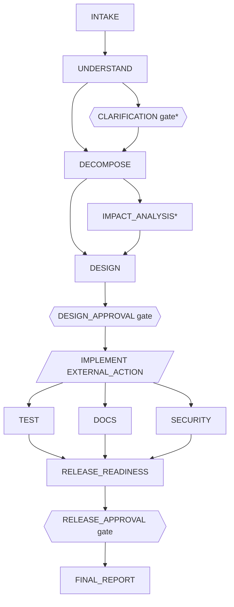

# Implementation Plan: Agentic Software Engineering System — URL Shortener

**Branch**: `master` (spec dir `001-agentic-sdlc-url-shortener`; no feature branch) |
**Date**: 2026-10-01 (amended at architecture review) | **Spec**: [spec.md](./spec.md) (approved 2026-10-01)

**Input**: Approved feature specification, clarification session 2026-10-01, ratified
constitution v1.0.0, architecture review amendments (revision 2: items 1–8; revision 3: items 1–5;
2026-10-01/02). The official assignment text
is not in the repository (ASM-001).

**Status**: APPROVED (revision 3) — architecture approved by the human candidate on 2026-10-02.
ADRs 0001–0005 accepted 2026-10-02; the ADR-0004/0005 amendments from the requirements-quality
gate resolutions below were re-accepted by the human candidate on 2026-10-02. Checklist gate
round-2 clarifications approved by the human candidate on 2026-10-02 (no architecture change).

## Summary

One Spring Boot application, one JVM, one H2 file database. Two packages with a one-way
dependency: the **application plane** (`link`) is a small URL shortener; the **control plane**
(`workflow`) runs a static 14-node DAG per submitted requirement. It persists every state change and
stops at human gates. **`IMPLEMENT` is an `EXTERNAL_ACTION`**: after design approval the run waits
while the engineer and/or Claude Code implement the change in the repository, and then a human or
agent records structured implementation evidence. Only after that do `TEST`, `DOCS` and `SECURITY` run concurrently against
the running build, followed by a join. Recovery uses bounded retry, timeout, one fallback,
attempt rollback, probe-link compensation, safe-stop and resume. Replanning bumps the plan
version and invalidates only descendants of the changed node, together with the approvals and
evidence attached to them. Recovery incidents and MTTR come from append-only audit events. The
application never writes code.

## Technical Context

**Language/Version**: Java 21 (JDK 21.0.1 installed)

**Primary Dependencies**: Spring Boot 3.5.x — `starter-web`, `starter-data-jpa`,
`starter-validation`, `starter-actuator`; Flyway 11.x; H2 2.3.x. Test: `starter-test`
(JUnit 5, AssertJ, Mockito, MockMvc). No other runtime libraries.

**Storage**: H2 file mode `./data/shortener`; Flyway-managed schema (7 tables, [data-model.md](./data-model.md))

**Testing**: JUnit 5 + MockMvc + `@SpringBootTest`; restart test over a temp H2 file; concurrency
test; `measurement`-tagged performance test excluded from the default build

**Target Platform**: Developer machine (Windows/macOS/Linux) with JDK 21

**Project Type**: Single web service (REST API), no UI

**Performance Goals**: PVT-003..005 measured and reported only (non-blocking)

**Constraints**: PVT-001 (2 retries), PVT-002 (5 s automated-stage timeout), PVT-006 (7-char codes,
5 attempts), PVT-007 (2,048-char URLs), PVT-008 (50 concurrent creates/redirects); single process;
no external services; no AI service; the application writes no source code

**Scale/Scope**: Demonstration: tens of workflow runs, thousands of links

## Constitution Check

*Gate before Phase 0 and re-checked after Phase 1 design (revision 3).*

| Principle / rule | Plan evidence | Pre | Post |
|---|---|---|---|
| I. Simplicity / YAGNI | 1 app, 1 module, 7 tables, 14 nodes = FR-ORC-002, 5 policy checks, no recovery table, no brokers/engines | PASS | PASS |
| II. SpecKit lifecycle & human authority | Plan PROPOSED; ADRs only listed; human gates are HUMAN-only; implementation evidence (EXTERNAL_ACTION) may be recorded by HUMAN or AGENT, never SYSTEM | PASS | PASS |
| III. Test-first | Slices define failing tests first; tests traced to FRs | PASS | PASS |
| IV. Governed orchestration | Explicit DAG, `EXTERNAL_ACTION` implementation step, HUMAN-only gates, real parallel group + join, persisted state, non-bypassable gates, bounded retry/timeout, fallback, rollback vs compensation, safe-stop, resume, replan | PASS | PASS |
| V. Secure URL handling | http/https only, unsafe schemes and literal private/loopback hosts rejected, limitation documented | PASS | PASS |
| VI. Evidence & traceability; policy | Append-only audit; provenance `ACTUAL`/`EXTERNAL`/`FALLBACK`; no claim that the app writes code; injected faults labeled; metrics DEMONSTRATION; policy v1 with 4 results; full exception record | PASS | PASS |
| VII. No silent drift | Revisions 2 and 3 record every amendment; sequencing changes listed for approval | PASS | PASS |
| Tech constraints | Preferred stack confirmed; nothing prohibited introduced | PASS | PASS |

No violations; Complexity Tracking is empty.

## Architecture Overview

```text
                    ┌──────────────────────── one JVM / one Spring Boot app ────────────────────────┐
HTTP clients ──────►│ link (application plane)            workflow (control plane)                   │
                    │  LinkController  /api/links          WorkflowController /api/workflows/...     │
                    │  RedirectController /r/{code}        WorkflowEngine (waves, locks, gates,      │
                    │  LinkService ◄─────────────────────    external action)                        │
                    │  UrlValidator, ShortCodeGenerator    stages/* (TEST, SECURITY call link — one- │
                    │  Link/Idempotency repos                way), Policy v1, Replanner, Audit,      │
                    │            └──────────────┬────────  Metrics (derived from events)             │
                    │                    H2 file DB (Flyway)                                         │
                    └────────────────────────────────────────────────────────────────────────────────┘
Engineer (HUMAN) and/or Claude Code (AGENT) ── edit repository, commit, restart app ── POST …/implementation
```

**Plane boundary**: `workflow` may call `link`'s public service API (probes, validator); `link`
never imports `workflow` (enforced by `PlaneBoundaryTest`). Separate tables; only
`link.probe_run_id` crosses (transient probe tag).

## Workflow DAG and stage contracts



The node set and edges are unchanged from revision 1; only `IMPLEMENT`'s kind changed.
`*` marks a conditional node (SKIPPED when its branch is not taken; the branch decision is
recorded). A node is eligible when all its dependencies are `SUCCEEDED` or `SKIPPED` and it is
`PENDING`.

**Common rules for automated nodes**:
- Actor is `engine`.
- Transitions: `PENDING→RUNNING→SUCCEEDED|FAILED`, and `RUNNING→PENDING` on attempt rollback.
- Timeout 5 s (PVT-002); up to 2 retries for transient failures (PVT-001).
- Events: `STAGE_STARTED`, `STAGE_SUCCEEDED`, `STAGE_FAILED`, `STAGE_TIMED_OUT`, retry and
  incident events, and `POLICY_EVALUATED` where a check is bound.

**Common rules for human gates** (`CLARIFICATION`, `DESIGN_APPROVAL`, `RELEASE_APPROVAL`):
- Satisfied only by `actorType = HUMAN`; an `AGENT` is always refused.
- Transitions: `PENDING→BLOCKED→SUCCEEDED|FAILED`.
- No timeout and no retry.

**External action** (`IMPLEMENT`):
- Work happens outside the application, done by the engineer and/or Claude Code.
- Evidence is recorded by `HUMAN` or `AGENT`.
- Transitions: `PENDING→BLOCKED→SUCCEEDED`.
- No timeout and no retry.

| Node | Purpose | Inputs | Output | Entry / exit | Failure class | Fallback / recovery | Extra audit |
|---|---|---|---|---|---|---|---|
| INTAKE | record requirement | request | intake record | non-blank ≤ 4000 / stored | PERMANENT (invalid) | — | `RUN_CREATED` |
| UNDERSTAND | normalize; map capabilities; AMB-R1..R4; green/brownfield; PRIV-01 | current requirement, registry | normalized requirement, findings, change type | — / all fields set | PERMANENT | — | `REQUIREMENT_NORMALIZED`, `AMBIGUITY_DETECTED`, `BRANCH_TAKEN` |
| CLARIFICATION (gate) | human resolves ambiguity | findings | clarification decision | findings ≠ ∅ else SKIPPED / valid decision | — | replan from UNDERSTAND | `CLARIFICATION_REQUESTED/RECEIVED` |
| DECOMPOSE | capabilities → tasks with acceptance checks | normalized req | task list | no open ambiguity / ≥ 1 task per capability; unknown capability ⇒ PERMANENT | PERMANENT | — | — |
| IMPACT_ANALYSIS | 10-area impact report from registry | tasks, registry | impact report | BROWNFIELD else SKIPPED / all areas populated | PERMANENT | — | `BRANCH_TAKEN` |
| DESIGN | components, interface/data changes, test plan, dependencies, security flag; SEC-01, CHG-01, DEP-01 | tasks, impact | design | — / every task mapped | PERMANENT | — | `POLICY_EVALUATED` |
| DESIGN_APPROVAL (gate) | human approves design (+ impact report) | design | decision | no unresolved policy issue / valid approval | — | rejection ⇒ `AWAITING_REWORK` | `APPROVAL_*` |
| **IMPLEMENT (EXTERNAL_ACTION)** | real implementation outside the app; human or agent records evidence | approved design | evidence: summary, changed artifacts, requirement IDs, revision; coverage vs designed components | valid design approval / valid evidence at current plan | — | invalidated on replan ⇒ re-record | `IMPLEMENTATION_REQUESTED/RECORDED` |
| TEST | real acceptance probes per capability via `LinkService`; delete probe links | tasks, evidence | probe results | — / all probes pass, probes cleaned | probe fail = PERMANENT | retry; **compensation** sweep on failed attempt | `COMPENSATION_*` |
| DOCS | API/behavior docs from design, registry, evidence | design, evidence | doc artifact | — / required sections | TRANSIENT/PERMANENT | retry, then **fallback** template | `FALLBACK_USED` |
| SECURITY | real validator probes (unsafe schemes, localhost, private literals) | design | probe results | — / all unsafe inputs rejected | PERMANENT if any accepted | retry for transient only; never fallback | — |
| RELEASE_READINESS (join) | verify checks per task, policies resolved, AUD-01; list residual risks (incl. designed components absent from evidence) | all outputs, policy rows | readiness report | — / no unresolved mandatory issue | PERMANENT | safe-stop | `POLICY_EVALUATED` |
| RELEASE_APPROVAL (gate) | human accepts release + residual risks | readiness report | decision | — / valid approval | — | rejection ⇒ `AWAITING_REWORK` | `APPROVAL_*` |
| FINAL_REPORT | engineering report from persisted records; **idempotent** | everything | report | valid release approval / stored | TRANSIENT | retry (safe to re-run) | `RUN_COMPLETED` |

**No destructive or irreversible application action exists** in this prototype. Probe cleanup
touches only the run's own probe data, and the report is idempotent. Any future destructive action
would need its own explicit human gate (FR-HUM-001; research R12).

## IMPLEMENT semantics (`EXTERNAL_ACTION`)

1. After `DESIGN_APPROVAL`, `IMPLEMENT` becomes `BLOCKED`. The run is `AWAITING_IMPLEMENTATION`
   with `pendingAction = RECORD_IMPLEMENTATION`, and an `IMPLEMENTATION_REQUESTED` event is
   emitted.
2. The engineer and/or Claude Code perform the change outside the application (SpecKit tasks,
   test-first), commit it, and restart the application if the code changed. The run survives the
   restart. **The application never writes, generates or modifies source code.**
3. `POST /api/workflows/{id}/implementation` must include `actorType` (`HUMAN` or `AGENT`),
   `actorIdentity`, `planVersion`, `summary` and `requirementIds`, and then one of:
   - `changedArtifacts` (non-empty) **and** `revision`, which is required whenever artifacts
     changed; or
   - an empty `changedArtifacts` **and** a `noChangeJustification`, meaning there was no
     code/config/schema change. This is accepted only when the current `DESIGN` output has
     `implementationRequired = false`.

   The request is refused (`400`/`409` plus `DECISION_REFUSED`) if the run isn't waiting for
   implementation, the plan version is stale, the actor is invalid or `SYSTEM`, or a rule above is
   broken. The application does **not** query Git.
4. The evidence is stored as an `IMPLEMENTATION_EVIDENCE` decision, and `IMPLEMENT` becomes
   `SUCCEEDED` with provenance **`EXTERNAL`**. Its output compares designed components with the
   changed artifacts, and gaps become residual risks.
5. `TEST`, `DOCS` and `SECURITY` become eligible. Their probes verify the running build's
   behavior; the application does not verify the revision itself.
6. A replan that affects `IMPLEMENT` invalidates the evidence (`DECISION_INVALIDATED`), so new
   evidence is required at the new plan version.

## State model

| Durable state | Values |
|---|---|
| Run status | `RUNNING` · waiting: `AWAITING_CLARIFICATION`, `AWAITING_APPROVAL`, `AWAITING_IMPLEMENTATION`, `AWAITING_REWORK` · halted: `SAFE_STOPPED` (`recoverable` flag) · terminal: `COMPLETED`, `FAILED` |
| Stage status | `PENDING`, `RUNNING`, `BLOCKED` (waiting for a human gate decision, external-action evidence or a policy-exception decision), `SUCCEEDED`, `FAILED`, `SKIPPED` |

A rejection is a `REJECTION` decision plus an `APPROVAL_REJECTED` event, and the run then waits
in `AWAITING_REWORK`. `pending_action` states the next required action — a human decision or the external action (NFR-005). The following are
audit events only, never statuses: retry, timeout, fallback, rollback, compensation, replan, policy
result, invalidation, refusal and recovery incident.

## Persistence and restart

Seven tables ([data-model.md](./data-model.md)): `link` (link + analytics columns),
`idempotency_record`, `workflow_run`, `workflow_stage`, `decision`, `policy_evaluation`,
`audit_event`. `recovery_record` was removed; incidents are derived from events.

- **Survives restart**: every run, stage, output, attempt, plan/policy version, decision (including
  implementation evidence), policy result, event and fault plan. In memory there are only locks
  and the thread pool.
- **Waiting runs**, in any `AWAITING_*` state, are fully described by their rows. After a restart,
  the next human command continues them normally. This is how an engineer restarts the app on new
  code while a run waits at `AWAITING_IMPLEMENTATION`.
- **Interrupted runs** (CHK033): at startup every non-terminal run is inspected.
  - `RUNNING` with a stage `RUNNING`: `ATTEMPT_ROLLED_BACK` (back to `PENDING`), then the
    compensation sweep, then `SAFE_STOPPED` (recoverable, `INTERRUPTED`).
  - `RUNNING` with no stage `RUNNING`: the idempotent compensation sweep, then `SAFE_STOPPED`
    (recoverable, `INTERRUPTED`).
  - `AWAITING_*` runs are untouched.
  - Nothing is re-executed automatically; continuing needs HUMAN `resume`.
- **Preservation**: the engine starts only `PENDING` eligible nodes, so `SUCCEEDED` nodes never
  re-run. A replan resets only descendants of the changed node.
- **Duplicate execution protection**: a per-run lock, a `@Version` optimistic lock, and a
  conditional `PENDING→RUNNING` update.

## API surface

Full contract: [contracts/openapi.yaml](./contracts/openapi.yaml) (19 paths).

| Plane | Endpoints |
|---|---|
| Application | `POST /api/links` (optional `Idempotency-Key`), `GET /r/{code}` (302/404/410/503, `no-store`), `GET /api/links/{code}` (details + analytics), `GET /actuator/health` |
| Control | `POST /api/workflows`, `GET /api/workflows/{id}` (main inspection: status, pending action, every node with kind, dependencies and state, policy results), `GET …/events`, `GET …/decisions`, `GET …/report`, `POST …/approve`, `POST …/reject`, `POST …/rework`, `POST …/terminate`, `POST …/clarify`, `POST …/implementation`, `POST …/requirement-change`, `POST …/policy-exceptions/{checkId}`, `POST …/resume`, `GET /api/metrics/workflows` |

## Human approval model

- **Actor model**: every decision and audit event records `actorType` (`SYSTEM` | `HUMAN` |
  `AGENT`) and `actorIdentity` (e.g. `workflow-engine`, a human name, `claude-code`).

  | Action | Allowed actor types |
  |---|---|
  | clarification; design approval/rejection; release approval/rejection (incl. residual-risk acceptance); policy-exception approval/rejection; rework; termination; requirement change; resume | `HUMAN` only |
  | implementation evidence (`EXTERNAL_ACTION`) | `HUMAN` or `AGENT` |
  | submit a requirement | `HUMAN` or `AGENT` |
  | branch decisions, invalidations, all stage events | `SYSTEM` (`workflow-engine`), engine-written; never accepted from the API |

  **An `AGENT` can never satisfy a human gate.** Identities are validated: blank and reserved
  identities are refused (`workflow-engine`, `system`; `claude-code` as `HUMAN`). Types are
  self-declared because there is no authentication (documented limitation).
- **Validation**: every command also needs a `reason` or summary and the `planVersion` acted on. A
  disallowed actor type, wrong gate or stale plan gets `409`/`400` and is recorded as
  `DECISION_REFUSED`.
- **No automatic approval**: nothing is approved by default or by timeout, and neither the gates
  nor the external action have a timer.
- **Rejection**: the run moves to `AWAITING_REWORK`. The human then either:
  - `rework`s from a chosen upstream node (for example `DESIGN` or `DOCS`). This replans from that
    node, the requirement is unchanged, and re-approval is required; or
  - `terminate`s the run, which ends `FAILED`. `terminate` is also allowed from any waiting state
    and from recoverable `SAFE_STOPPED` (CHK002).
- **Security-sensitive decisions**: `DESIGN` flags security-relevant changes in the approval
  subject, and SEC-01 `FAIL` blocks the run before approval is possible.

## Reliability model

| Mechanism | Plan |
|---|---|
| Classification | TRANSIENT / PERMANENT; timeout = TRANSIENT; validation/policy/invariant = PERMANENT |
| Retry | transient only; 3 attempts; 100 ms, 200 ms backoff; `RETRY_SCHEDULED`, `RETRY_EXHAUSTED` |
| Timeout | `Future.get(5 s)` + cancel; `STAGE_TIMED_OUT`; gates and `IMPLEMENT` exempt |
| Fallback | `DOCS` only → minimal template meeting exit criteria, provenance `FALLBACK` |
| **Rollback** (attempt/transaction) | output + `SUCCEEDED` commit together; a failed, timed-out or interrupted attempt commits nothing and the stage returns to `PENDING` (`ATTEMPT_ROLLED_BACK`) |
| **Compensation** (committed side effects) | `TEST` probe links are committed by `LinkService` in their own transactions, so attempt rollback cannot undo them. A sweep deletes all links tagged with the run after a failed `TEST` attempt, on `TEST` invalidation, and on `FAILED`/`SAFE_STOPPED`. On success `TEST` deletes its probes itself and keeps evidence in output + events. A sweep failure ⇒ safe-stop (non-recoverable) |
| Fault timing | injected after executor work, before completion commit, so `TEST` faults exercise both rollback and compensation |
| Safe-stop | mandatory policy FAIL (non-recoverable); retry exhausted, no fallback (recoverable); invalid state (non-recoverable); compensation failure (non-recoverable); restart interruption (recoverable) |
| Permanent failure | `IMPLEMENTATION_DEFECT` (TEST/SECURITY probe failure after evidence) ⇒ compensation sweep, then `AWAITING_REWORK`; other permanent failures ⇒ compensation sweep, then `FAILED` |
| Partial failure | succeeded branches kept; join blocked; resume re-runs only the failed branch |
| Idempotency | link creation via `Idempotency-Key`; `FINAL_REPORT` regeneration; compensation sweep |

## Recovery incidents and MTTR (revised)

There is no recovery table. Incidents are derived from append-only events:
- `FAILURE_DETECTED` opens an incident; its `seq` is the incident id.
- `RECOVERY_STARTED` records the mechanism: `RETRY`, `FALLBACK`, `COMPENSATION` or `RESUME`.
- `RECOVERY_COMPLETED` closes the incident as recovered.
- `RECOVERY_FAILED` closes it as unrecovered.

This covers FR-OBS-003: detection time, recovery start, recovery completion, mechanism and
outcome.

Metrics (`GET /api/metrics/workflows`, labeled `DEMONSTRATION`):
- success/failure counts and rates;
- retry count and frequency;
- rollback count (`ATTEMPT_ROLLED_BACK`) and compensation count (`COMPENSATION_COMPLETED`);
- recovery durations;
- unrecovered and open incidents;
- end-to-end duration, wall clock and excluding human wait;
- **MTTR = Σ duration(recovered) / count(recovered)**.

`MetricsTest` checks the MTTR arithmetic on a known event sequence.

## Replanning model

`replan(fromNode, cause, reason)`. Steps 2–5 run in **one database transaction**. On failure,
everything rolls back, the prior state is unchanged, and `REPLAN_ABORTED` is recorded separately:
1. Affected = `fromNode` plus its descendants.
2. Run the compensation sweep if `TEST` is affected.
3. Reset affected nodes to `PENDING`, copying their prior outputs into `STAGE_INVALIDATED` events.
4. Record `DECISION_INVALIDATED` for approvals **and implementation evidence** on affected nodes.
5. Set `planVersion+1` and record `PLAN_REPLANNED {old, new, reason, affected, preserved}`.
6. Advance the run.

Causes: a clarification or requirement change (replan from `UNDERSTAND`), or rework (from the
chosen node). Nothing is deleted.

## Policy model (v1, five checks — one per FR-POL-002 domain)

| Check | Domain | After | Result path demonstrated |
|---|---|---|---|
| PRIV-01 | privacy | UNDERSTAND | `EXCEPTION_REQUESTED` → human exception record |
| SEC-01 | security | DESIGN | `FAIL` → safe-stop before design approval |
| CHG-01 | change control | DESIGN | brownfield `PASS`; greenfield `NOT_APPLICABLE` |
| DEP-01 | dependencies & licensing | DESIGN | added deps on approved list, else `FAIL`; none ⇒ `NOT_APPLICABLE` |
| AUD-01 | audit evidence | RELEASE_READINESS | audit completeness incl. decisions + evidence |

- **Removed (YAGNI)**:
  - `SEC-02`: the validator probes are `SECURITY`'s exit criteria.
  - `CHG-02`: approval presence is structurally required before `IMPLEMENT`.
- All checks are mandatory. A `FAIL` leads to safe-stop. `EXCEPTION_REQUESTED` blocks the node
  until a human approves the exception (policy id, reason, scope, actor, compensating control,
  timestamp, expiry/review) or rejects it.
- Readiness fails on any unresolved issue.

## Audit and observability

`audit_event` is append-only and sequenced per run. Each event records run id, correlation id,
node, actor, timestamp, plan version, policy version, the injected flag and a JSON payload
(result, reason, metadata). There is no mutation path. The catalog is in
[data-model.md](./data-model.md). SLF4J logs carry `runId` in the MDC, and Actuator exposes
`health` only.

## Security approach

- **Input checks**: URI parsing; `http`/`https` only; host required; at most 2,048 characters.
- **Rejected hosts** (checked without DNS):
  - `localhost`;
  - loopback, private, link-local and unspecified IPv4/IPv6 literals;
  - non-canonical numeric hosts.
- **Documented limitations**: a hostname that resolves to a private address is not blocked, and
  the service never fetches destination URLs itself.
- **Errors**: Problem Details with a `category` field and no stack traces.
- **Hygiene**: Actuator exposes `health` only; dependencies limited to Boot starters, Flyway and
  H2; the audit log has no mutation path.
- **Not provided**: authentication, rate limiting, malware checks.

## Test strategy (traced, not inflated)

| Area | Tests | Covers |
|---|---|---|
| URL validation | `UrlValidatorTest` (parameterized) | FR-URL-002/003/016, PVT-007, SC-008 |
| Codes & collision | `ShortCodeGeneratorTest`, `LinkServiceCollisionTest` | FR-URL-004/005, PVT-006 |
| Link API | `LinkApiTest`: create, redirect, 404, analytics, idempotency 201/200/409, Problem format (+ 410 after SCN-B) | FR-URL-001..011, 015 |
| Storage failure | `LinkStorageFailureTest`: 503s; analytics failure still redirects | FR-URL-013/017 |
| Concurrency | `LinkConcurrencyTest` (50 + 50) | FR-URL-012, PVT-008, SC-009 |
| Health | `HealthTest` | FR-URL-014 |
| Graph | `WorkflowGraphTest`: acyclic, 14 nodes, deps, kinds | FR-ORC-001/002 |
| Ambiguity | `AmbiguityRulesTest`: SCN-A/B clear, SCN-C R2+R4, conflict, edge-case-only not flagged | FR-ORC-016 |
| Engine | `WorkflowEngineTest`: order, branch skip, overlap (injected DELAY), join waits, entry/exit | FR-ORC-003..008, SC-002 |
| Gates & external action | `HumanGateTest`: no progress without decision; `AGENT`/`SYSTEM`/blank/reserved actors refused at human gates; wrong gate, stale plan refused; reject → rework/terminate; evidence rules (revision required with changes, justification required without, justification refused when `implementationRequired`) | FR-HUM-*, SC-003 |
| Reliability | `RecoveryTest`: retry+rollback+compensation, permanent, exhaustion → safe-stop, timeout, fallback, compensation failure, partial failure resume | FR-REL-*, SC-004/006 |
| Replan | `ReplannerTest`: affected/preserved, approval + evidence invalidation, plan version | FR-ORC-013, SC-007 |
| Policy | `PolicyTest`: five checks, FAIL blocks, exception approve/reject, readiness blocked | FR-POL-* |
| Audit & metrics | `AuditTest` (append-only), `MetricsTest` (incident derivation, MTTR) | FR-OBS-*, SC-010 |
| Restart | `RestartPersistenceTest`: gate wait, implementation wait, interrupted stage | FR-ORC-006, NFR-004, SC-005 |
| Scenarios | `ScenarioATest`, `ScenarioBTest`, `ScenarioCTest` (MockMvc, test-fixture evidence) | FR-SCN-001..003 |
| Boundary | `PlaneBoundaryTest`, `CapabilityRegistryTest` (IMPLEMENTED entries reference real classes) | NFR-003, R6 |
| Measurement | `PerformanceMeasurementTest` @Tag("measurement") | PVT-003..005 (report only) |

## Scenario execution design

| | SCN-A Greenfield | SCN-B Brownfield | SCN-C Ambiguous |
|---|---|---|---|
| UNDERSTAND | CREATE/REDIRECT/ANALYTICS (registry: PLANNED) → GREENFIELD | EXPIRATION on IMPLEMENTED links → BROWNFIELD | findings AMB-R2, AMB-R4 |
| Branches | CLARIFICATION, IMPACT_ANALYSIS SKIPPED | CLARIFICATION SKIPPED; IMPACT_ANALYSIS runs | CLARIFICATION BLOCKED |
| Policy | CHG-01 N/A, DEP-01 N/A | CHG-01 PASS | after clarification: as SCN-B |
| Human | approve design | approve design (impact report in subject) | clarify (plan 1→2), approve design |
| IMPLEMENT | core shortener built (slice 3) → evidence with changed files + revision | expiration built (slice 7) → evidence with changed files + revision | **decided after the real clarification**: replanned `DESIGN` sets `implementationRequired`; if `false`, evidence may use `noChangeJustification`; if `true`, real changes + revision, then downstream validation |
| Then | TEST‖DOCS‖SECURITY → join → release approval → COMPLETED | same | same |
| Replan | — | — | from UNDERSTAND; preserved INTAKE (+ clarification decision); stale plan-1 decisions refused |

**Corrected SCN-B sequence**: requirement → `UNDERSTAND` (brownfield) → `DECOMPOSE` →
`IMPACT_ANALYSIS` → `DESIGN` (CHG-01 PASS) → **human design approval** → `AWAITING_IMPLEMENTATION`
→ expiration implemented in the repository (migration, 410 behavior, registry → IMPLEMENTED,
tests first), committed, app restarted → **evidence recorded** → `TEST` ‖ `DOCS` ‖ `SECURITY`
→ `RELEASE_READINESS` → **human release approval** → `FINAL_REPORT` → `COMPLETED`. No expiration
code exists before design approval.

**SCN-C behavior after clarification**:
1. The human's actual clarification is recorded, and the run replans from `UNDERSTAND` (plan 1→2).
2. The rules re-check for ambiguity; if any remains, the run returns to `AWAITING_CLARIFICATION`.
3. `DECOMPOSE`/`IMPACT_ANALYSIS`/`DESIGN` compare the clarified behavior with the capability
   registry. `implementationRequired = false` only if every requested capability is
   `IMPLEMENTED`, nothing asks to change one, and no behavior detail falls outside the capability's
   recorded behavior. Otherwise it is `true`.
4. The human reviews that conclusion at design approval and can reject it.
5. Evidence follows the rules above. `TEST`/`SECURITY` always validate the running build.

Nothing is pre-decided. If the clarification asks for new behavior (for example a default expiry
period), it becomes real implementation work, and the registry gains that behavior and its probe as
part of the change.

## Requirements-quality gate resolutions (checklists/orchestration.md, 2026-10-02)

> If this summary and `research.md` R19/R20 ever differ, `research.md` is authoritative.

Amendments requested by the human candidate after `/speckit.checklist`. Each closes or clarifies a
checklist item; none changes the DAG, the planes or the technology.

| Item | Resolution | Where |
|---|---|---|
| CHK004 | Implementation evidence `requirementIds` must be a non-empty subset of the run's requirement IDs. Those IDs are fixed by `DECOMPOSE` from the capability registry, carried into the approved `DESIGN`, and stored in its output. Any other ID ⇒ `409` (`EVIDENCE_SCOPE_MISMATCH`) plus a recorded `DECISION_REFUSED`. | ADR-0004 §3, data-model, OpenAPI |
| CHK007 | **Replanning is atomic.** One database transaction covers: affected-stage resets, `STAGE_INVALIDATED` events, `DECISION_INVALIDATED` records (approvals and evidence), the probe-link compensation sweep (same database), the plan-version increment, `PLAN_REPLANNED`, and the run status change. If it fails, it rolls back and the prior workflow state is unchanged. A `REPLAN_ABORTED` event is then written in a separate transaction and the command returns an error (`REPLAN_FAILED`). Engine advancement starts only after commit. | ADR-0004 §6, research R10 |
| CHK034 | A clarification that contradicts an approved requirement is **not** an ordinary clarification. Approved behavior statements are held per capability in the registry, with requirement IDs (e.g. "links without an expiration never expire", FR-URL-008). A deterministic conflict rule ⇒ `/clarify` is refused with `409` (`CHANGE_CONTROL_REQUIRED`) and recorded. The human must submit it via `requirement-change`, which replans. `DESIGN` then lists `changesApprovedRequirements`; CHG-01 requires the impact analysis to cover them; design approval explicitly shows them. The repository `spec.md` must be amended through SpecKit change control before implementation (constitution VII). An approved requirement is never silently overridden. | ADR-0004 §8, research R12 |
| CHK036 | When `TEST` or `SECURITY` fails a probe after evidence was accepted, the failure is `PERMANENT` with code `IMPLEMENTATION_DEFECT`. The compensation sweep runs, `RECOVERY_STARTED(REWORK)` is recorded, and the run moves to **`AWAITING_REWORK`** (`pendingAction = REWORK_OR_TERMINATE`). The HUMAN either reworks from `IMPLEMENT` or any node upstream of it, or terminates. Rework invalidates the evidence (and any later approvals), bumps the plan version, and requires new evidence and downstream validation. `FAILED` is reserved for explicit termination, and for permanent failures where rework isn't permitted (invalid input, invariant violations). Safe-stop rules are unchanged. | ADR-0005 §8, data-model |
| CHK038 | **Fault injection is disabled by default** (`workflow.fault-injection.enabled=false`). It is enabled only by explicit configuration: the `demo` Spring profile or test properties. A run created with `faults` while disabled ⇒ `400` (`FAULT_INJECTION_DISABLED`). A run with a fault plan is an *injected run*; every effect is labeled `injected=true`. Metrics accept `?faultInjected=true\|false` (omitted = all) and always report `injectedRuns`, so demonstration data stays separable. | ADR-0005 §10, OpenAPI, quickstart |
| CHK002 | `terminate` (HUMAN only) is allowed from every waiting state (`AWAITING_CLARIFICATION`, `AWAITING_APPROVAL`, `AWAITING_IMPLEMENTATION`, `AWAITING_REWORK`) and from recoverable `SAFE_STOPPED`. It runs the compensation sweep and ends the run `FAILED` with a `TERMINATION` decision. Non-recoverable `SAFE_STOPPED` is already final. | ADR-0004 §4, OpenAPI |
| CHK003 | Waiting runs never expire (FR-HUM-003). They stay in their waiting state with `pendingAction` visible until a human acts or terminates them. Metrics count them as in progress, not as failures. | this plan |
| CHK006 | Exception expiry/review is evaluated once, at `RELEASE_READINESS`. A dated expiry that has passed makes the exception count as unapproved, so readiness fails until a new exception decision is recorded. A non-date review condition is recorded and shown in the final report, not machine-evaluated. Expiry has no effect after a run completes. | research R11 |
| CHK010 | Clarification rounds repeat until the rules find no material ambiguity. Each round is one `CLARIFICATION` decision plus one replan (plan +1). There is no automatic limit; the human may terminate (CHK002). | research R5 |
| CHK016 | "Human wait" = time in `AWAITING_CLARIFICATION`, `AWAITING_APPROVAL`, `AWAITING_IMPLEMENTATION` (external engineering), `AWAITING_REWORK`, and recoverable `SAFE_STOPPED` until resumed. Metrics report wall-clock duration, *automated active* duration (excluding all of these; used for PVT-004), and per-waiting-state totals. | research R16 |
| CHK017 | MTTR includes human reaction time for `RESUME`/`REWORK` recoveries, because that is the real time to recover. MTTR is also reported per mechanism, so automatic recovery (`RETRY`, `FALLBACK`, `COMPENSATION`) is visible separately. | research R16 |
| CHK026 | The plan version is the revision of the run's plan: the decomposition, the design, and all downstream work and decisions derived from them. Every replan, including `DOCS` rework, bumps it, so every approval and every evidence record refers to one unambiguous revision. This interprets the spec's terminology; the spec is unchanged. | research R10 |
| CHK030 | **Success rate** = `COMPLETED` / finished runs, where finished = `COMPLETED` + `FAILED` + non-recoverable `SAFE_STOPPED`. **Failure rate** = (`FAILED` + non-recoverable `SAFE_STOPPED`) / finished. Waiting and recoverable safe-stopped runs are in progress and excluded from both rates. **Retry frequency** = retries / automated attempts. **Unrecovered** = incidents closed with `RECOVERY_FAILED`. **Open** incidents are reported separately and excluded from MTTR and from unrecovered. | research R16 |
| CHK035 | Duplicate or concurrent identical decisions and evidence are serialized by the per-run lock. The second one finds the run no longer waiting for it, so it gets `409` plus `DECISION_REFUSED` (refused, not replayed). Clients re-read the run. | ADR-0003 §7 |
| CHK037 | Self-declared `actorType` (no authentication, EXC-003) is an **accepted risk**, owned by the human candidate and accepted with ADR-0004 on 2026-10-02. It is listed in the README limitations, and production would bind actor types to authenticated identities. | ADR-0004 Risks |

## Checklist gate clarifications — round 2 (2026-10-02)

> If this summary and `research.md` R19/R20 ever differ, `research.md` is authoritative.

Human decisions: CHK009 (approved spec clarification) and CHK042 (ASM-001 accepted). All other rows
are clarifications with no architectural change. Full text is in research R5 (CHK011), R6 (CHK012),
R11 (CHK018) and R20.

| Item | Clarification |
|---|---|
| CHK008 | Replan/rework invalidates recorded evidence but cannot undo Git changes. Reverting or adjusting them is external engineering work. New evidence with a new revision is required before downstream validation. |
| CHK009 | spec FR-REL-008 now states the approved recoverable mapping. Recoverable: retries exhausted without fallback; restart interruption. Not recoverable: policy FAIL; rejected exception; invalid state; compensation failure. |
| CHK011 | AMB-R1..R4 are defined with exact bounded term lists and regexes (R5). No other interpretation is used. |
| CHK012 | Recorded behavior statements B1..Bn per capability, with FR IDs. `implementationRequired = false` only if all capabilities are IMPLEMENTED, there is no behavior change verb and no out-of-record detail pattern (R6). |
| CHK013 | Material = changes observable behavior, acceptance criteria, capability scope, API/data contract, security/privacy, policy outcome or approved semantics. HUMAN-initiated via `requirement-change`. The runtime never infers materiality (R20). |
| CHK015 | "Same stage path" = same nodes executed/skipped, branches, gate locations, success/failure class and code, and requirement/capability decisions. Timestamps, IDs, thread names, codes, probe IDs and intra-wave event order may differ (R20). |
| CHK018 | PRIV-01 term list and DEP-01 approved list with licenses verified from POM metadata. Transitive Hibernate LGPL-2.1+ noted for awareness (R11). |
| CHK024 | Evidence is refused before a valid design approval, and its timestamp must be later than that approval. Traceability shows approval before evidence. The runtime cannot observe external editing start (limitation) (R20). |
| CHK027 | Overlap is proven via controlled instrumentation (stub delay, injected `DELAY`) on the real scheduler. The delay makes concurrency measurable and does not simulate it (R20). |
| CHK028 | SC-003 denominator = every observed HUMAN_GATE crossing attempt in the gate/scenario tests plus the three live runs. Each needs a preceding valid HUMAN decision at the current plan version. Expected 100% (R20). |
| CHK033 | Startup recovery covers `RUNNING` runs with **or without** a `RUNNING` stage: sweep, then recoverable `SAFE_STOPPED INTERRUPTED`. No automatic re-execution (R20). |
| CHK039 | Whole-command safety bound: ≤ 5 waves × 15.3 s ≈ 76.5 s, stated bound **90 s**. This is a safety bound, not a target. PVT-004 unchanged (R20). |
| CHK042 | ASM-001 kept and explicitly accepted. The official brief remains the external authoritative source above repository artifacts; it is not copied in. |

## ADR candidates (to be written after approval; status Proposed until human acceptance)

1. **ADR-001** Single-process modular monolith (Java 21 / Spring Boot 3.5 / Maven), plane boundary.
2. **ADR-002** Persistence: file-backed H2 + Flyway + JPA, 7 tables, append-only audit, derived incidents.
3. **ADR-003** In-process DAG engine: static graph, wave scheduling, synchronous advancement, locks,
   deterministic executors, `EXTERNAL_ACTION` implementation step, provenance.
4. **ADR-004** Human governance and replanning: HUMAN-only gates, actor model, evidence rules, decision lineage, plan
   versioning, rework, invalidation, policy v1.
5. **ADR-005** Reliability and recovery: classification, retry/timeout, fallback, attempt
   rollback vs compensation, safe-stop, resume, restart recovery, fault injection, MTTR.

## Material technology decisions

| Decision | Alternatives | Consequences | Risks | Reversibility | Validation |
|---|---|---|---|---|---|
| Spring Boot 3.5 monolith | Boot 4.0, plain Java, services | familiar, fast | 3.5 support horizon | high | `mvnw verify` (first build downloads uncached artifacts, then offline) |
| H2 file + Flyway + JPA | in-memory H2, Postgres, JdbcClient | durable, zero-install, versioned schema | H2 dialect quirks | high | restart test |
| Wave-scheduled in-process DAG | async runner, workflow engines | deterministic, real parallelism | HTTP blocks during automated work | medium | engine + overlap tests |
| `IMPLEMENT` as `EXTERNAL_ACTION` | simulated change plan | real governance of real changes; long-lived waiting runs | evidence and actor type are self-declared | high | gate/evidence tests; TEST probes |
| Incidents from audit events | recovery table | one immutable source | derivation logic must be correct | high | `MetricsTest` |
| Analytics on `link` row | separate table | atomic single `UPDATE` | — | high | concurrency test |

## Delivery slices (input to `/speckit.tasks`) — re-sequenced

Every slice is test-first, ends green, and stops at a checkpoint. **Live scenario runs** use the
demo database `./data`, and their events are exported at slice 8.

| # | Slice | Delivers | Depends on |
|---|---|---|---|
| 1 | Walking skeleton | Maven wrapper, Boot app, H2 file, Flyway, health, Problem Details, `.gitignore` | — |
| 2 | Orchestration core + governance | DAG, run/stage/decision/policy/audit persistence, engine waves and locks, INTAKE…DESIGN executors, ambiguity rules, capability registry (all `PLANNED`), policy v1 (PRIV-01, SEC-01, CHG-01, DEP-01), gates (approve/reject/rework/terminate/clarify), IMPLEMENT external action + evidence API, actor model, inspect APIs. **Live SCN-A run started and design approved here.** | 1 |
| 3 | Core URL shortener = SCN-A implementation | validator, codes, create/redirect/analytics, idempotency, 503s, concurrency — no expiration; registry → `IMPLEMENTED` | 2 (approved SCN-A design) |
| 4 | Validation & release | TEST (probes + cleanup), DOCS, SECURITY, RELEASE_READINESS (AUD-01), FINAL_REPORT, metrics skeleton; **record SCN-A evidence → SCN-A completes** | 3 |
| 5 | Reliability | fault injection, retry, timeout, fallback, attempt rollback, compensation sweep, safe-stop, resume, startup recovery, incident events | 4 |
| 6 | Replanning & metrics | replanner, clarification/requirement-change, invalidation of approvals and evidence, policy exceptions, full metrics/MTTR | 5 |
| 7 | SCN-B real brownfield + SCN-C | start SCN-B run → impact analysis → **design approval** → implement expiration (V-next migration, 410) → evidence → complete; then SCN-C clarify → replan → implement only if `implementationRequired` → complete | 6 |
| 8 | Release readiness & docs | README, architecture/ADR links, exported scenario evidence, traceability, measurement run, clean-clone check | all |

- **Critical path**: 1 → 2 → 3 → 4 → 5 → 6 → 7 → 8.
- **Must-have**: every slice at minimum depth.
- **Stop conditions**:
  - a red test at the end of a slice;
  - any deviation from the approved spec, plan or ADRs (constitution VII);
  - an incompatible workflow-schema change while the live SCN-A run is waiting. In that case,
    stop and decide with the human; do not rewrite history.
- **Deferred / optional**: a second fallback, async execution, authentication.
- **Risk of a long-lived live run**: SCN-A waits across slices 3–4, so workflow schema changes in
  those slices must be additive Flyway migrations, and the graph is frozen after slice 2.

## Complexity review

- **Removed in this revision**:
  - the `recovery_record` table;
  - the `SIMULATED` provenance;
  - the irreversible-node mechanism;
  - policy checks SEC-02 and CHG-02;
  - keeping probe links after completion.
- **Removed in revision 3**: `GET /api/workflows` (list) and the separate graph/Mermaid endpoint.
  `GET /api/workflows/{id}` shows the graph through each node's kind, dependencies and state.
- **Still optional / cuttable**: the `COMPENSATION_FAILURE` fault type, which exists only to test
  one safe-stop trigger.
- **Added, with justification**: the `AWAITING_IMPLEMENTATION` run status and the evidence
  endpoint, both required by revision-2 amendment 1 (refined in revision 3 as `EXTERNAL_ACTION`). They are the minimum needed to wait for real external
  work.

## Trade-offs and limitations

- HTTP commands block while automated stages run, at most about 3 × 5 s per wave.
- Implementation evidence is self-reported. The app checks its structure, and the probes check
  behavior, but the app does not verify commit ids.
- Ambiguity and brownfield detection are vocabulary rules over a known capability set.
- The capability registry is hand-maintained and guarded by a test.
- There is no actor authentication: `actorType` is self-declared, so the HUMAN-only rule is
  explicit and testable but not tamper-proof. Metrics come from a few local runs with injected
  faults.

## Decisions requiring human architecture approval

1. New run status **`AWAITING_IMPLEMENTATION`** for the `EXTERNAL_ACTION`, alongside
   `AWAITING_REWORK`.
2. **Live SCN-A sequencing**: build orchestration first (slice 2), start the SCN-A run and approve
   its design, and only then implement the core shortener (slice 3) and record evidence (slice
   4). This keeps "approval before implementation" true for greenfield as well. The alternative is
   to build the shortener first and record SCN-A evidence retrospectively, which is weaker and
   would need to be labeled as such.
3. **Actor model and evidence rules**: `actorType`/`actorIdentity`; HUMAN-only gates;
   `revision` required with changes; `noChangeJustification` required without changes and only
   when `implementationRequired = false`. SCN-C's implementation need is decided after the real
   clarification, not in advance.
4. **Policy v1 = 5 checks** (PRIV-01, SEC-01, CHG-01, DEP-01, AUD-01).
5. Package `com.agentic.shortener`, coordinates `com.agentic:url-shortener`.
6. ADR set of 5 as listed.

## Project Structure

### Documentation (this feature)

```text
specs/001-agentic-sdlc-url-shortener/
├── spec.md, checklists/requirements.md   # approved
├── plan.md                               # this file
├── research.md                           # Phase 0
├── data-model.md                         # Phase 1
├── quickstart.md                         # Phase 1
├── contracts/openapi.yaml                # Phase 1
└── tasks.md                              # /speckit.tasks (not created here)
```

### Source Code (repository root)

```text
pom.xml, mvnw, mvnw.cmd, .mvn/wrapper/
src/main/java/com/agentic/shortener/
├── ShortenerApplication.java
├── common/            # ProblemDetail handler, error categories
├── link/              # application plane: controllers, LinkService, UrlValidator,
│                      #   ShortCodeGenerator, Link, IdempotencyRecord, repositories
└── workflow/          # control plane
    ├── api/           # WorkflowController, MetricsController, request/response records
    ├── engine/        # WorkflowGraph, Node, WorkflowEngine, StageExecutor, StageContext,
    │                  #   StageResult, RetryTimeoutRunner, FaultInjector, Replanner,
    │                  #   Compensation, StartupRecovery
    ├── stages/        # one executor per automated node (10)
    ├── rules/         # AmbiguityRules, CapabilityRegistry
    ├── policy/        # PolicyCatalog (v1), PolicyEvaluator
    ├── audit/         # AuditService (append-only)
    ├── metrics/       # MetricsService (incidents derived from events)
    └── persistence/   # entities + repositories for the 5 workflow tables
src/main/resources/
├── application.yml
└── db/migration/      # workflow tables (slice 2), links (slice 3), link expiration (slice 7)
src/test/java/com/agentic/shortener/   # mirrors main; scenario/ for SCN-A/B/C
docs/                  # created only with real content: adr/, architecture/, scenarios/, traceability/
```

**Structure Decision**: single Maven module, two top-level packages per plane plus `common`; the
plane boundary is enforced by `PlaneBoundaryTest`.

## Complexity Tracking

No constitution violations to justify.
